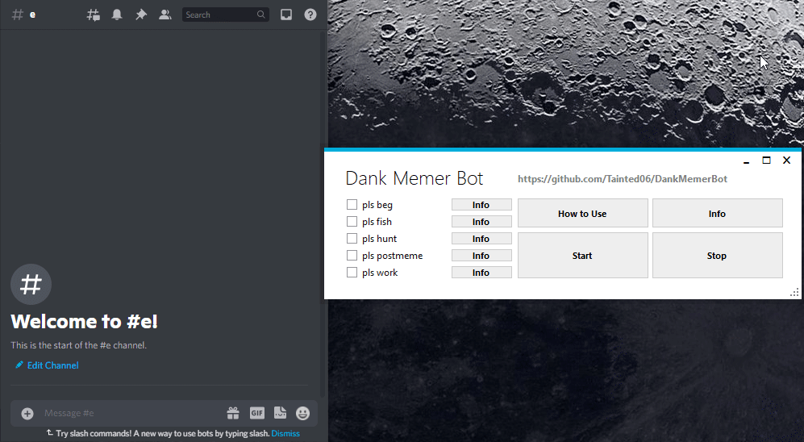
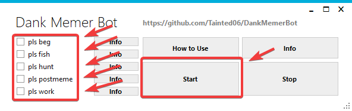

# Simple Dank Memer Auto Bot

#### Disclaimer: This is against Discord's and Dank Memer's TOS, this will get you banned, it is just a proof of concept, use at your own risk!

This is a very simple dank memer auto bot, it just types in the commands for you. There are a lot better ones out there, I put this together when I was beginning to code so it isn't that good. I started this project but then finished it off hastily and kinda abandoned it, so I came back at a later date and finished it off properly.

## How to use:

1. Pick the commands you would like to use

2. Click Start
 

3. Click on the send message text field on discord
 

4. Done! The program should now automatically send commands

### I will not be updating this project, if it breaks, it breaks `¯\_(ツ)_/¯`
### Contact Tainted#0069 on discord if you have any questions
